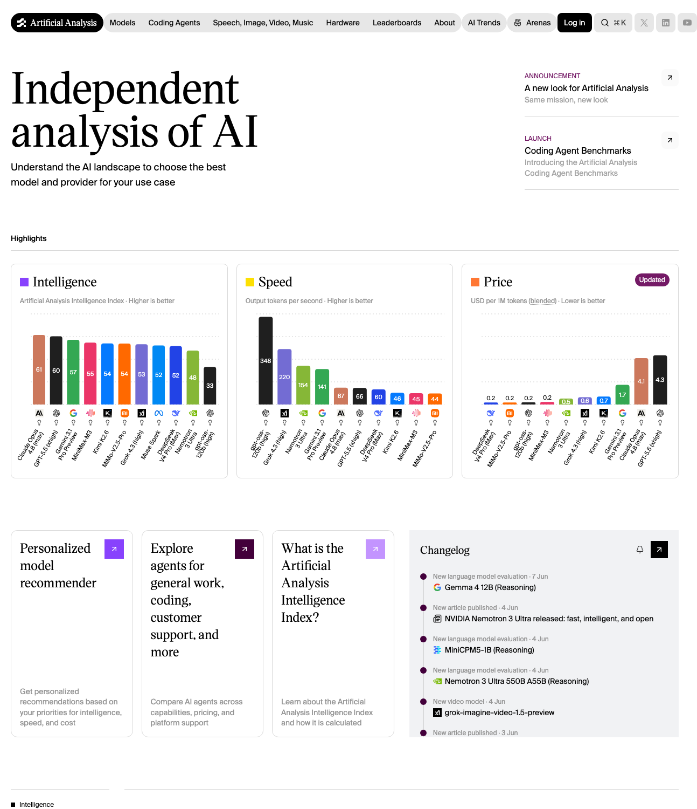

# American open models are catching up: Nemotron-3 Ultra matched GPT-5.5 in our coding-agent benchmark

*Source: Artificial Analysis homepage screenshot, captured June 8, 2026. The chart shows Nemotron 3 Ultra appearing close to leading frontier models on the Artificial Analysis Intelligence Index.*

Open models are getting harder to dismiss.

For years, the assumption was simple: if you wanted the strongest model, you used a closed frontier model. Open models were useful, but mostly for experiments, cost savings, or self-hosting.

That assumption is starting to break.

We tested **NVIDIA Nemotron-3 Ultra 550B-A55B**, an American open model from NVIDIA, against **GPT-5.5** on three real coding-agent tasks using Token Station Arena.

The result was the story:

> Nemotron-3 Ultra completed the same benchmark workload as GPT-5.5.

Both models passed **9 out of 9** runs.

This does not mean every open model beats every closed model. It means something more important for developers and companies:

> American open models are now strong enough to compete on real agent workloads, not just toy prompts.

You can try Nemotron-3 Ultra, GPT-5.5, and other frontier models through **[tokens.bytefuture.ai](https://tokens.bytefuture.ai)**.

## Why this matters

The open-vs-closed model debate used to be mostly philosophical.

Open models gave developers more control. Closed models usually gave better performance.

But when an American open model can complete the same coding-agent benchmark tasks as GPT-5.5, the conversation changes.

The question is no longer:

> Are open models useful?

The better question is:

> Which workloads still require a closed frontier model, and which workloads can now run on a powerful open model?

That distinction matters for real products.

AI agents are not just chatbots. They read files, modify code, call tools, run tests, retry failed steps, and operate across long workflows. For this kind of usage, model choice is not only about raw capability. It is also about control, cost structure, availability, and whether the model can be adapted to the business.

That is where open models are becoming strategically important.

## The American open model we tested

The open model in this benchmark was **NVIDIA Nemotron-3 Ultra 550B-A55B**.

Its model profile:

- **550B total parameters**
- **55B active parameters**
- MoE / latent-MoE style architecture
- Developed by NVIDIA, an American AI infrastructure company
- Currently free to use in our setup

This is not a small model being used only because it is inexpensive. It is a large American open model designed for serious reasoning and agent workloads.

GPT-5.5 remains a leading closed frontier model. It is powerful, polished, and widely useful. But Nemotron-3 Ultra represents a different kind of value: a strong open model with more transparent model characteristics and a more controllable deployment profile.

For developers and businesses, that matters.

## The benchmark setup

We used **Token Station Arena** to run a coding-agent benchmark.

The setup:

- **2 models**: GPT-5.5 and NVIDIA Nemotron-3 Ultra 550B-A55B
- **3 coding-agent tasks**
- **3 runs per task per model**
- **18 total runs**

The benchmark used deterministic checks such as unit tests, typecheck, clippy, and task-specific validation.

This is important because coding agents should not be judged only by whether their answers sound good. They need to make real code changes and pass checks.

## The three coding-agent tasks

### 1. Add an API endpoint

This task tests whether the model can make a normal product development change inside an existing codebase.

The agent has to understand the project structure, find the right route or handler, add the endpoint, return the expected response, and keep the project checks passing.

This is the kind of task developers do every day. It is not a puzzle. It is practical engineering work.

### 2. Fix a failing test

This task tests debugging ability.

The agent is given a broken test or bug scenario. It has to identify the underlying issue, fix the implementation, and restore passing tests.

This matters because real coding agents need to recover from failures. They cannot only write new code when everything is clean and obvious.

### 3. Refactor pricing logic

This task tests whether the model can improve code structure without changing business behavior.

The agent has to preserve pricing rules while passing unit tests, typecheck, clippy, and a refactor-specific validation check.

This is closer to real production engineering than a simple code-generation prompt. The model has to understand both code and business logic.

## Results

| Metric | GPT-5.5 | NVIDIA Nemotron-3 Ultra 550B-A55B |
|---|---:|---:|
| Completed runs | **9/9** | **9/9** |
| Average judge score | **5.0** | **4.8** |

The important result is task completion.

Both models completed every run.

That is the marketing signal:

> An American open model completed the same coding-agent workload as GPT-5.5.

For developers, this is a meaningful shift. Open models are no longer just fallback options. They are becoming serious candidates for real agent systems.

## Open models are catching up

The broader AI market is moving toward a multi-model world.

Closed models still matter. They often set the frontier and remain excellent choices for many high-value tasks.

But open models are catching up quickly. They are becoming capable enough for practical coding, reasoning, and agent workflows. They also offer advantages that closed models cannot always provide:

- More control over deployment strategy
- Better fit for private or internal workflows
- More predictable long-term infrastructure planning
- More flexibility for customization
- Less dependence on a single closed provider

Nemotron-3 Ultra is especially important because it is an American open model from NVIDIA. For companies that care about both AI capability and infrastructure control, that combination is strategically relevant.

## Why this matters for Token Station

The future is not one model for every task.

Some workloads need a closed frontier model. Some workloads can now run on a powerful open model. Many teams will want to test both before deciding what to use in production.

That is exactly why **tokens.bytefuture.ai** exists.

With Token Station, developers can access models like Nemotron-3 Ultra, GPT-5.5, and other frontier models through one platform. Instead of choosing based on brand names or assumptions, teams can compare models on their own workloads.

The point is not to declare one universal winner.

The point is to make model choice practical.

## Try it

American open models are catching up with closed frontier models.

Nemotron-3 Ultra matching GPT-5.5 on our coding-agent completion benchmark is one more signal that the model landscape is changing.

Try Nemotron-3 Ultra and other frontier models at **[tokens.bytefuture.ai](https://tokens.bytefuture.ai)**.
